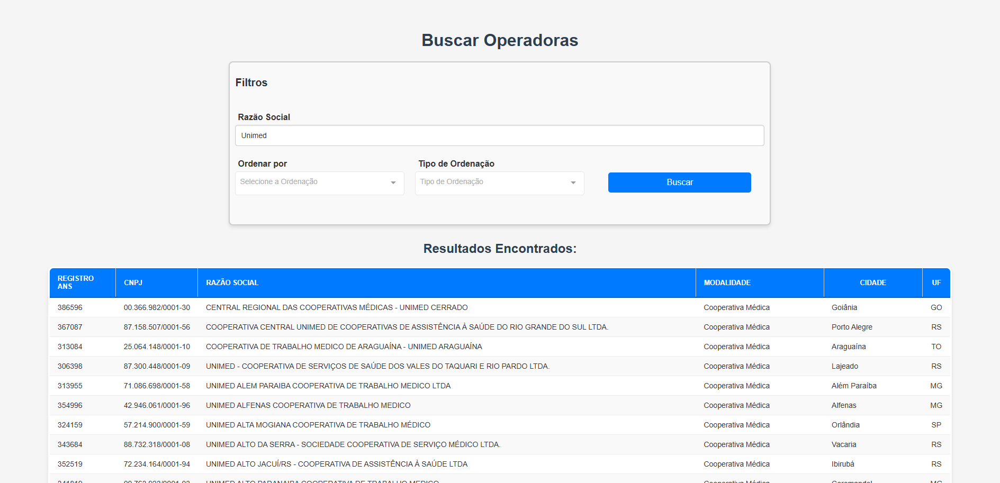
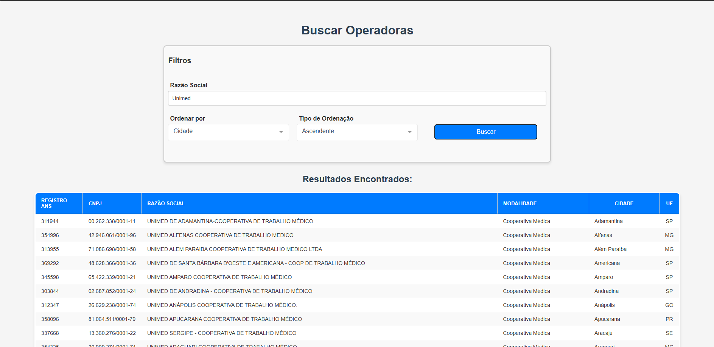

# TESTE DE API

Este repositório contém um teste de API que inclui o desenvolvimento de uma interface web utilizando Vue.js que interage com um servidor em Python para realizar buscas pela razão social das Operadoras Ativas na ANS no formato CSV registradas no arquivo Relatorio_cadop.csv disponível em [Dados cadastrais das Operadoras Ativas na ANS](https://dadosabertos.ans.gov.br/FTP/PDA/operadoras_de_plano_de_saude_ativas/).

## Descrição

O objetivo deste projeto é:
- Utilizar o CSV obtido no item 3.2. do teste para realizar buscas textuais na lista de cadastros de operadoras.
- Implementar um servidor em Python com uma rota capaz de buscar os registros mais relevantes.
- Demonstrar os resultados utilizando uma coleção no Postman.

## Estrutura do Projeto

- **backend**: Contém o código do servidor Python.
- **frontend**: Contém a interface web desenvolvida em Vue.js.

## Configuração do Ambiente

Siga as instruções abaixo para configurar e executar o projeto:

### Passos para Instalação

1. Clone este repositório para sua máquina local:
   ```bash
   git clone <URL_DO_REPOSITORIO>

2. Instale os pacotes necessários:

 - Para o backend:

    - Certifique-se de que o Python está instalado.

    - Entre na pasta backend e execute: `pip install flask`

 - Para o frontend
     
    - Certifique-se de que o Node.js e o npm estão instalados.

    - Entre na pasta frontend e execute: `pm install vue axios`


## Executando o Projeto

Entre na pasta backend utilizando o terminal e execute : `python server.py`

Entre na pasta frontend utilizando o terminal e execute : `npm run serve`


## Testando a Aplicação

- Interface Web: Use a interface web para interagir com o servidor e realizar buscas textuais.

- Postman: Para testar diretamente as rotas do servidor:

- Importe a coleção do Postman fornecida.

- Faça requisições às rotas configuradas e verifique os resultados.

## API - Backend em Flask

Esta API foi desenvolvida utilizando o framework Flask e tem como objetivo realizar buscas textuais em uma lista de cadastros de operadoras, retornando os registros mais relevantes.

### Estrutura da API

- **`POST /operadoras`**:
  - **Descrição**: Realiza uma busca textual na lista de cadastros de operadoras com suporte a critérios de ordenação.
  - **Parâmetros**:
    - `query` (string): Texto a ser buscado nos registros de `Razao_Social`.
    - `order_by` (string): Nome da coluna para ordenar os resultados (ex.: `Razao_Social`).
    - `order_dir` (string): Direção da ordenação, podendo ser `Ascendente` ou `Descendente`.
  - **Retorno**:
    - JSON contendo os registros que correspondem à busca, substituindo valores `NaN` por `"Não informado"`.

- **`GET /get_csrf_token`**:
  - **Descrição**: Gera e retorna um token CSRF para ser usado nas requisições que exigem proteção contra ataques CSRF.
  - **Retorno**:
    - JSON com o token CSRF gerado.

---

### Funcionalidades de Segurança Adicionadas

#### 1. **Proteção contra CSRF (Cross-Site Request Forgery)**:
  - **Biblioteca utilizada**: `flask-wtf.csrf`.
  - **Descrição**: 
    - Implementada proteção CSRF que valida tokens para todas as requisições POST, garantindo que apenas requisições de fontes confiáveis sejam aceitas.
    - Endpoint `/get_csrf_token` fornece o token CSRF necessário para o frontend enviar junto às requisições.

#### 2. **Validação e Sanitização de Dados**:
  - **Descrição**:
    - Os dados enviados pelos usuários são validados pela função `validate_request_data()`:
      - Garante que o parâmetro `query` seja uma string.
      - Verifica se o parâmetro `order_by` corresponde às colunas válidas: `Registro_ANS`, `CNPJ`, `Razao_Social`, `Modalidade`, `Cidade`, `UF`.
      - Confirma que o parâmetro `order_dir` seja `Ascendente` ou `Descendente`.
    - Sanitização implementada com `html.escape()` para limpar entradas de possíveis códigos maliciosos.

#### 3. **Proteção CORS (Cross-Origin Resource Sharing)**
- **Descrição**:
  - Apenas origens autorizadas podem acessar os endpoints da API. As origens permitidas incluem:
    - `http://localhost:8080` (Frontend Vue.js).
    - `http://127.0.0.1:5000` (Acessos locais via Postman ou outras ferramentas de teste).
  - A configuração permite métodos específicos (`GET` e `POST`), e o suporte a credenciais (`supports_credentials`) está habilitado.
  - **Objetivo**:
    - Facilitar o acesso local para testes com Postman e ao mesmo tempo garantir restrições adequadas ao acesso externo.

#### 4. **Limitação de Requisições (Rate Limiting)**:
  - **Biblioteca utilizada**: `flask-limiter`.
  - **Descrição**: 
    - Limite de 100 requisições por minuto para o endpoint `/operadoras`.
    - Protege contra abusos de uso ou ataques de força bruta.

#### 5. **Logs Detalhados**:
  - **Biblioteca utilizada**: `logging`.
  - **Descrição**:
    - Registra informações sobre todas as requisições recebidas, incluindo detalhes de erros de validação.
    - Os logs são salvos na pasta `Logs` dentro do diretório `backend`, garantindo organização e monitoramento eficiente.
    - Uso de `RotatingFileHandler` para manter o tamanho do arquivo de log sob controle.

---

### Como acessar a API via Postman

#### Acesso ao Endpoint `/operadoras`
- **URL:** `http://127.0.0.1:5000/operadoras`
- **Método:** `POST`
- **Body (JSON)**:
```json
{
    "query": "Unimed",
    "order_by": "Razao_Social",
    "order_dir": "Ascendente"
} 
```

#### Cabeçalhos Necessários

- **Content-Type:** `application/json`
- **X-CSRFToken:** `[Token gerado pelo endpoint /get_csrf_token]`

---
   
## Frontend - Interface em Vue.js

A interface web foi desenvolvida em Vue.js e permite aos usuários realizar buscas textuais de operadoras e exibir os resultados em forma de tabela.

---

### Estrutura do Componente

#### Template
O HTML do componente é responsável por renderizar a interface com os seguintes elementos:
- **Campo de busca**: Input para a Razão Social da operadora.
- **Botão de busca**: Dispara a consulta ao backend.
- **Tabela**: Exibe as informações das operadoras retornadas pela API.

## Dependências

 - Vue.js: Framework JavaScript para desenvolvimento da interface web.

 - Axios: Biblioteca JavaScript para realizar requisições HTTP.

 - Python: Necessário para rodar o servidor backend.

 - Flask: Framework para desenvolvimento do servidor em Python.

## Exemplo de Funcionamento da API com Interface WEB em VUE.js

Abaixo estão imagens demonstrando o funcionamento da aplicação e os filtros em ação:

### Busca por Razão Social


### Seleção de Ordenação



